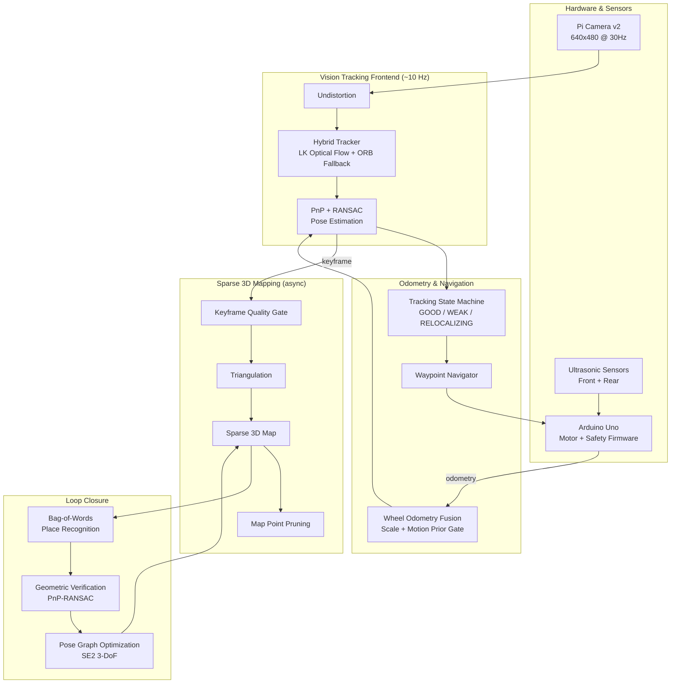

# Edge-Deployed 3D Vision and Localization for Autonomous Systems

A real-time, metric-scale **monocular Visual SLAM** system built from scratch in Python/OpenCV, running entirely on a **Raspberry Pi 4B with no GPU**. It powers a differential-drive robot that localizes, maps, and navigates indoor environments using only a $5 camera and wheel odometry — no LiDAR, no depth sensor, no cloud offload.

> Final Year Project — BEE, School of Electrical Engineering & Computer Science, NUST Islamabad. Supervised by Dr. Jameel Nawaz & Dr. Wajid Mumtaz.

[](https://www.python.org/)
[](https://opencv.org/)
[](https://www.raspberrypi.com/)
[](https://www.ros.org/)

---

## Why this project matters

Every open-source monocular SLAM system (ORB-SLAM2/3, DSO, SVO2) assumes a desktop-class CPU or a GPU. None of them satisfy all three of these constraints simultaneously:

1. **Monocular input** — no stereo baseline, no depth sensor
2. **Metric accuracy** — the map must carry real-world scale for navigation to work
3. **Edge deployment** — a Raspberry Pi 4B (4× ARM Cortex-A72 @ 1.8 GHz, no GPU)

This project reimplements the core ideas behind PTAM and ORB-SLAM from the ground up — hybrid optical-flow/feature tracking, sparse Bundle Adjustment, Bag-of-Words loop closure, pose-graph optimization — specifically engineered to hit **10 Hz real-time tracking** on that hardware.

---

## Results at a glance

Benchmarked across **275 runs / 121,042 frames** of live robot operation:

| Category | Result |
|---|---|
| Tracking frontend | Hybrid LK+ORB, **34.6 FPS** average, LK used in 85.1% of frames |
| Live tracking latency | **17.4 ms** median (LK) vs 70.1 ms (ORB fallback) — 4–5× speedup |
| Bundle Adjustment | Reduced from **4,000 ms → 80–120 ms** per keyframe via sparse Jacobian (**50× speedup**), 90.9% acceptance rate |
| Loop closure drift correction | 100 m trajectory error reduced from **1.6 m → 0.18 m** |
| Waypoint navigation accuracy | **92.6%** of runs landed within 20 cm; mean final error **17.5 cm** |
| Relocalization recovery | **100%** recovery in 15/15 forced-failure trials via breadcrumb backtracking (mean 9.4 s) |
| Hardware cost | Under **PKR 60,000** (~$215) vs PKR 2.8M–28M for LiDAR AGVs |

Full benchmark methodology, plots, and comparisons against ORB-SLAM2/3, DSO, and SVO2 are in the [project report](docs/final_report.pdf).

---

## System architecture



Two computing nodes split responsibilities: the **Pi** runs all SLAM/vision/navigation logic in Python, while an **Arduino Uno** independently handles motor PWM, dead-reckoning, and ultrasonic obstacle detection — so hardware safety never depends on the vision pipeline staying alive.

An auxiliary **human pose estimation** subsystem (MediaPipe, running on an idle core) provides operator-awareness telemetry via an MJPEG stream and JSONL logs, fully decoupled from the tracking loop.

---

## Core technical contributions

- **Hybrid LK + ORB tracking frontend** — Lucas-Kanade optical flow for fast (µs-per-point) frame-to-frame tracking, with automatic ORB re-detection fallback when confidence drops.
- **Custom sparse-Jacobian Bundle Adjustment** — hand-built COO→CSR sparsity pattern fed into SciPy's trust-region solver, cutting BA time by 50× and enabling it to run asynchronously without blocking tracking.
- **Hysteresis-based tracking state machine** with a **breadcrumb backtracker** that physically reverses the robot along its stored odometry trail to recover from total tracking loss — 100% recovery in forced-failure trials.
- **Wheel-odometry fusion for monocular scale recovery** — resolves the fundamental scale ambiguity of single-camera SLAM, feeding a PnP initial guess, a motion-consistency sanity gate, and an absolute scale correction.
- **From-scratch Bag-of-Words loop closure + 3-DoF Pose Graph Optimization**, implemented in NumPy without DBoW2/g2o dependencies, cutting 100 m drift from 1.6 m down to 0.18 m.
- **Zero-modification ROS/Gazebo simulation bridge** — Python `sys.modules` injection swaps hardware drivers for ROS shims, so the exact production SLAM codebase runs unmodified in simulation.
- **Hardware-aware engineering**: rolling-shutter blur mitigation, motor deadband compensation, EMA-calibrated odometry, and a "freeze-frame" motor pause during slow ORB detection.

---

## Repository structure

```
.
├── control/
│   ├── motor_controller.py       # Pi<->Arduino serial bridge, odometry parsing
│   └── arduino/
│       └── car_control.ino       # Motor PWM, deadband, ultrasonic safety firmware
├── vision/
│   ├── camera_model.py           # Calibration, intrinsics
│   ├── camera_stream.py          # Full-FOV capture, motion-blur mitigation
│   ├── collect_init_data.py      # Image-odometry pair collection for init
│   ├── init_map_from_dataset.py  # Offline map initialization + scale bootstrap
│   ├── map.py                    # Map / Keyframe / MapPoint data structures
│   ├── live_map_growth.py        # Main tracking + navigation loop (entrypoint)
│   ├── local_ba.py               # Sparse Bundle Adjustment
│   ├── loop_closer.py            # Bag-of-Words place recognition
│   └── pgo.py                    # 3-DoF Pose Graph Optimization
├── simulation/
│   ├── sim_pipeline.launch       # Bootstraps Gazebo + shim injection
│   ├── depot_world_robot.launch  # Simulated environment
│   ├── spawn_robot.launch        # URDF/Xacro robot description
│   └── ros_shims.py              # sys.modules hardware→ROS interception
├── perception/
│   └── monocular_human_scale_pi.py  # MediaPipe human pose + anthropometric depth
├── web_stream.py                 # Flask MJPEG debug server
├── docs/
│   └── final_report.pdf          # Full FYP report (architecture, benchmarks, results)
└── README.md
```

*(Adjust paths above to match your actual folder layout — this reflects the module breakdown described in the project report.)*

---

## Hardware platform

| Component | Spec | Role |
|---|---|---|
| Raspberry Pi 4B | 4 GB LPDDR4, 4× ARM Cortex-A72 @ 1.8 GHz, Ubuntu Server 22.04 | Compute |
| Arduino Uno | C++ firmware | Real-time motor/sensor control |
| Pi Camera Module v2 | 8MP Sony IMX219, rolling shutter, 640×480 @ 30Hz | Vision sensor |
| TB6612FNG dual H-bridge | Dual DC motors | Drive system |
| 2× HC-SR04 | Front + rear | Obstacle detection |
| 3-cell LiPo battery | 5V reg. rail (Pi) + 9V direct (motors) | Power |

Total hardware cost: **~PKR 60,000–65,000** (~$215–235 USD).

---

## Software dependencies

```
Python 3.13
opencv-python==4.13
numpy==2.4.1
scipy==1.17.1
pyserial==3.5
mediapipe          # human pose estimation subsystem
flask              # MJPEG streaming
```

For simulation: **ROS 1 (Noetic)** + **Gazebo**.

---

## Getting started

```bash
# Clone
git clone https://github.com/<your-username>/Edge-Deployed-3D-Vision-and-localization-for-Autonomous-Systems-Software.git
cd Edge-Deployed-3D-Vision-and-localization-for-Autonomous-Systems-Software

# Install dependencies
pip install -r requirements.txt
```

### 1. Calibrate the camera
```bash
python vision/calibrate_camera.py --chessboard 7x9 --square-size 44
```

### 2. Bootstrap the initial map
```bash
python vision/collect_init_data.py         # collect image+odometry pairs
python vision/init_map_from_dataset.py      # triangulate + scale-bootstrap
```

### 3. Run live SLAM + navigation on the robot
```bash
python vision/live_map_growth.py --target-x 2.0 --target-y 0.0
```

### 4. Or test in simulation first (no hardware required)
```bash
roslaunch simulation sim_pipeline.launch
```

### 5. Run the human pose estimation subsystem (optional)
```bash
python perception/monocular_human_scale_pi.py --min-pose-conf 0.5
# View live stream at http://<pi-ip>:5000/video_feed
```

---

## How it works — pipeline summary

| Stage | What happens |
|---|---|
| **0. Calibration** | OpenCV `calibrateCamera()` on a 40–60 image chessboard set; distortion pre-computed once via `initUndistortRectifyMap`. |
| **1. Map initialization** | Robust frame-pair selection (feature density, parallax, motion prior) → ORB matching → Essential Matrix → triangulation → metric scale from measured wheel-odometry baseline. |
| **2. Live tracking** | LK optical flow (primary, ~3 ms) or ORB re-detection (fallback, ~150–300 ms) → PnP-RANSAC pose solve, warm-started with an odometry-derived pose guess. |
| **3. Keyframe/map management** | Keyframes inserted on motion thresholds (0.10 m / 10°); points pruned via a found/visible ratio with age- and maturity-based grace periods. |
| **4. Tracking state machine** | Three states (`GOOD` / `WEAK` / `RELOCALIZING`) with hysteresis to prevent thrashing; pose-jump gating rejects geometrically impossible motions. |
| **5. Local Bundle Adjustment** | Sparse-Jacobian, Huber-loss nonlinear least squares over a 3–5 keyframe sliding window, with pre/post-solve validation gates. |
| **6. Loop closure** | Bag-of-Words candidate retrieval → PnP-RANSAC geometric verification (≥30 inliers) → SE(2) Pose Graph Optimization. |
| **7. Odometry fusion** | Wheel deltas provide PnP initial guess, motion-consistency sanity gate, and absolute scale correction. |
| **8. Navigation** | `TURN_TO_FACE → DRIVE → FINAL_ORIENTATION → DONE` state machine, gated by tracking stability ("Swiss cheese" safety model) and backed by breadcrumb-trail backtracking on total tracking loss. |
| **9. Human pose (auxiliary)** | MediaPipe VIDEO-mode landmarks → anthropometric-prior depth estimation (shoulder/hip/leg/height anchors) → EMA-smoothed distance + orientation classification. |

---

## Benchmarked against published SLAM systems

| | Monocular | Real-time | Loop closure | Scale from odometry | ROS-free | Runs on Pi-class HW |
|---|---|---|---|---|---|---|
| **This project** | ✅ | ✅ | 🟡 partial | ✅ | ✅ | ✅ |
| ORB-SLAM2 | ✅ | ✅ | ✅ | ❌ | ❌ | ❌ |
| ORB-SLAM3 | ✅ | ✅ | ✅ | ❌ | ❌ | ❌ |
| DSO | ✅ | ✅ | ❌ | ❌ | ❌ | ❌ |
| SVO2 | ✅ | ✅ | ❌ | ❌ | ❌ | 🟡 partial |

Per-component latency on Pi 4B vs published desktop-i7 numbers, sparse-vs-dense algorithm comparisons, and full ablation results are documented in the [report](docs/final_report.pdf), Sections 7–8.

---

## Future work

- Active SLAM: route planning that favors feature-rich areas when tracking confidence drops
- Additional sensors (bump switches, edge/fall detection) for a full safety envelope
- Learned/hybrid visual odometry for texture-starved environments
- Persistent map serialization for map-and-localize (vs. remap-every-run) operation
- Full SE(3) 6-DoF pose graph for non-planar platforms (drones, stair-climbers)
- Person-following and predictive collision avoidance using the existing pose estimation subsystem

---

## Authors

- **Maleeha** — 414469
- **Rayyan Naeem** — 414044

School of Electrical Engineering and Computer Science (SEECS), National University of Sciences and Technology (NUST), Islamabad, Pakistan.

Supervised by **Dr. Jameel Nawaz** and **Dr. Wajid Mumtaz**.

## References
Key papers this work builds on: PTAM (Klein & Murray, 2007), ORB-SLAM (Mur-Artal et al., 2015), ORB-SLAM2 (Mur-Artal & Tardós, 2017), DBoW2 (Gálvez-López & Tardós, 2012), g2o (Kümmerle et al., 2011), EPnP (Lepetit et al., 2009). Full reference list in the [report](docs/final_report.pdf).
